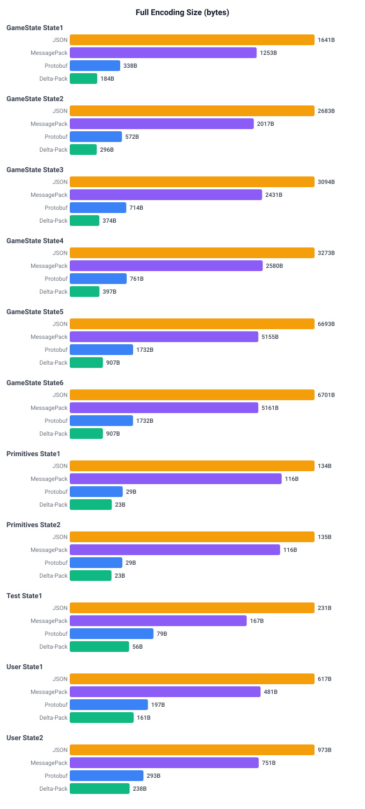
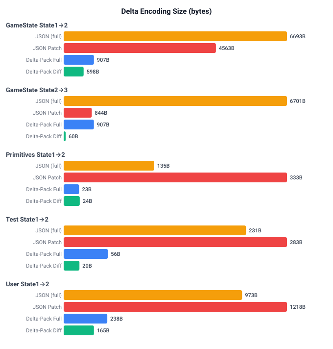

# Encoding Size Benchmarks

Language-agnostic comparison of serialization formats by encoded size.

Compares full encoding sizes across JSON, MessagePack, Protobuf, and Delta-Pack, then compares delta encoding sizes between JSON Patch (RFC 6902) and Delta-Pack diffs.

For performance benchmarks, see:

- TypeScript: `typescript/benchmark/`
- C#: `csharp/benchmarks/`
- Rust: `rust/benchmarks/`

## Running

```bash
npm run bench            # Run benchmarks
npm run bench -- --save  # Run and save charts to charts/
```

## Full Encoding Size (bytes)

Lower is better. Each group is independently scaled.



## Delta Encoding Size (bytes)

Compares delta-pack diffs against JSON Patch (RFC 6902) for incremental updates.


