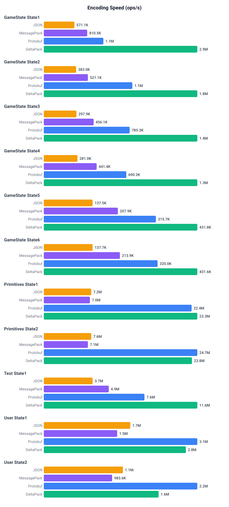
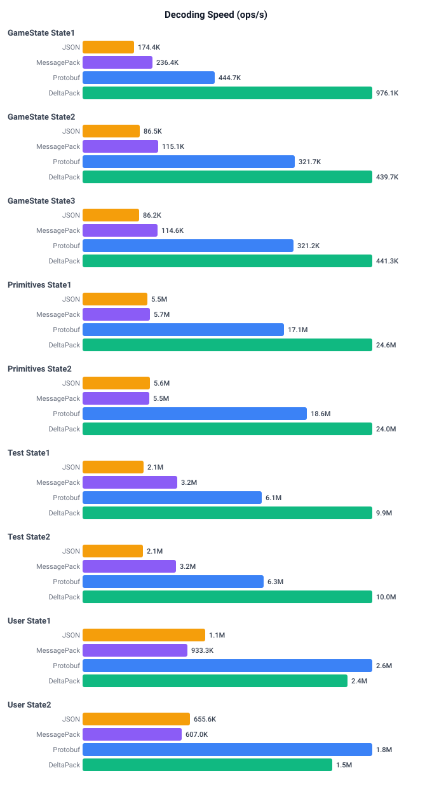

# C# Performance Benchmarks

Performance comparison of DeltaPack against System.Text.Json, MessagePack-CSharp, Protobuf, and Apache.Avro.

## Running

```bash
# From csharp directory
benchmarks/build.sh                         # Generate code
dotnet run -c Release --project benchmarks  # Run all benchmarks (codegen mode)

# Run specific benchmarks (case-insensitive, partial match)
dotnet run -c Release --project benchmarks Primitives
dotnet run -c Release --project benchmarks GameState User

# Run in interpreter mode
dotnet run -c Release --project benchmarks -- --interpreter
dotnet run -c Release --project benchmarks -- --interpreter Primitives

# Save charts to benchmarks/charts/
dotnet run -c Release --project benchmarks -- --save
```

## Modes

- **Codegen mode** (default): Uses pre-generated C# code for DeltaPack serialization
- **Interpreter mode** (`--interpreter`): Parses YAML schemas at runtime and uses the interpreter for DeltaPack operations

The interpreter mode is useful for comparing the performance overhead of runtime schema parsing vs compile-time code generation. JSON, MessagePack, and Protobuf always use their generated/native implementations in both modes.

## Results (codegen)

### Encoding Speed (ops/s)



### Decoding Speed (ops/s)


