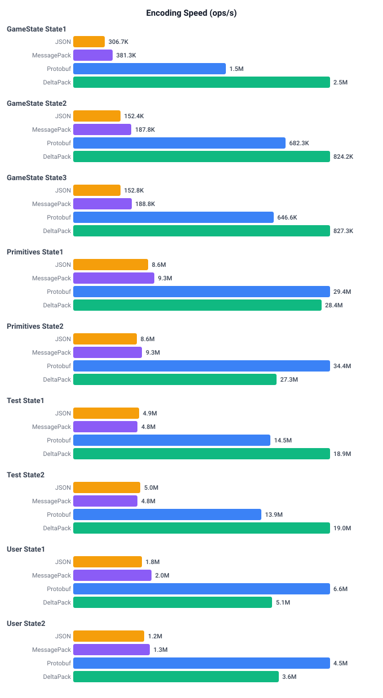
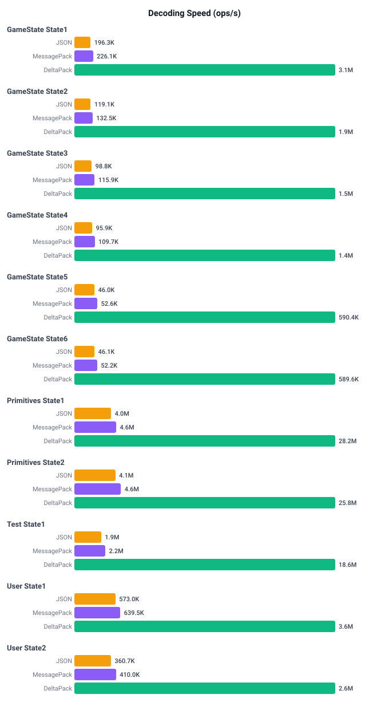

# Rust Performance Benchmarks

Performance comparison of DeltaPack against serde_json, rmp-serde (MessagePack), and prost (Protobuf).

## Running

```bash
# From rust directory
benchmarks/build.sh                    # Generate code
cargo run --release -p delta-pack-benchmarks  # Run all benchmarks

# Run specific benchmarks (case-insensitive, partial match)
cargo run --release -p delta-pack-benchmarks -- primitives
cargo run --release -p delta-pack-benchmarks -- gamestate user

# Save charts to benchmarks/charts/
cargo run --release -p delta-pack-benchmarks -- --save

# Run with schemas defined via `#[derive(DeltaPack)]` instead of CLI-generated code
cargo run --release -p delta-pack-benchmarks -- --derive
cargo run --release -p delta-pack-benchmarks -- --derive gamestate
```

The benchmarks support two delta-pack modes:
- **Codegen mode** (default): schemas pre-generated from YAML via the CLI (`rust/generated/examples/`).
- **Derive mode** (`--derive`): schemas defined as native Rust structs/enums with `#[derive(DeltaPack)]` — the derive macro expands to equivalent code at compile time, so runtime performance is comparable.

## Results (codegen)

### Encoding Speed (ops/s)



### Decoding Speed (ops/s)


