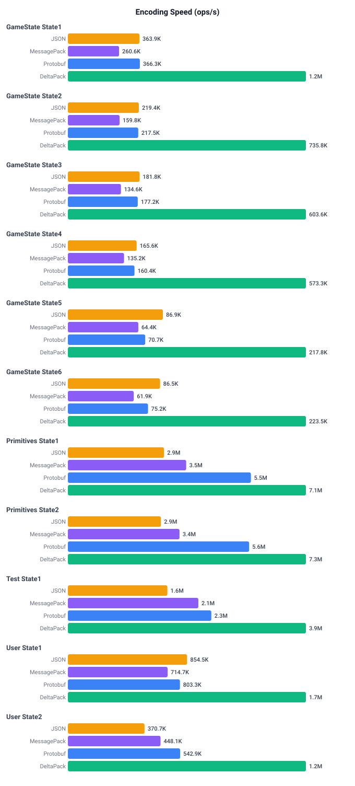
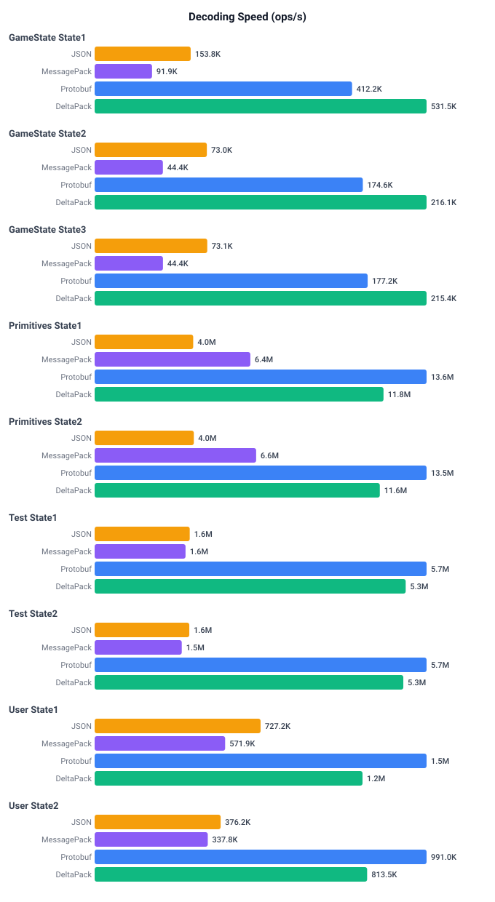

# TypeScript Performance Benchmarks

Performance comparison of DeltaPack against JSON, MessagePack, and Protobuf.

## Running

```bash
# From the typescript directory
npm run bench:build  # Generate code + compile
npm run bench        # Run all benchmarks (codegen mode)

# Run specific benchmarks (case-insensitive, partial match)
npm run bench primitives
npm run bench gamestate user

# Run in interpreter mode (parses schemas at runtime)
npm run bench -- --interpreter
npm run bench -- --interpreter primitives

# Browser benchmarks
npx serve benchmark  # then open http://localhost:3000
# Optional query params: ?mode=interpreter&filter=primitives
```

## Modes

- **Codegen mode** (default): Uses pre-generated TypeScript/JS for DeltaPack and Protobuf
- **Interpreter mode** (`--interpreter`): Parses YAML schemas and .proto files at runtime

## Results (codegen)

Benchmarks run on Node v24.11.1, Apple M4 Pro.

### Encoding Speed (ops/s)



### Decoding Speed (ops/s)


